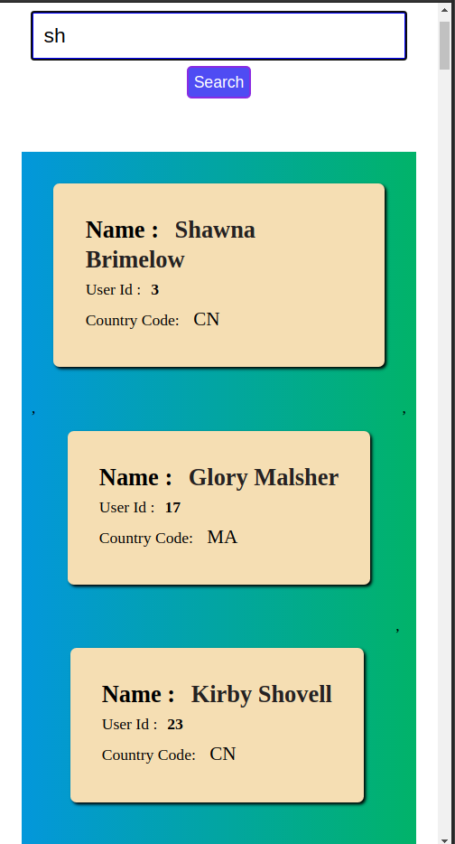

# Basic Search Engine

## Preview

1. As we add letter in the input we can fetch the data after submitting or entering

2. Adding some text and searching based on that text

3. It is Using ILIKE to ignore case sensitivity

4. This is just mobile view ;)

---

### Idea

- Fetch data from the database as per the user search

### Tools in Backend

1. Postgres database
2. Nodejs for Creating API

### NPM Packages

1. Express - Express is a minimal and flexible Node.js web application framework that provides a robust set of features for web and mobile applications.

2. Cors - Cross-Origin Resource Sharing (CORS) is an HTTP-header based mechanism that allows a server to indicate any origins (domain, scheme, or port) other than its own from which a browser should permit loading of resources. CORS also relies on a mechanism by which browsers make a "preflight" request to the server hosting the cross-origin resource, in order to check that the server will permit the actual request. In that preflight, the browser sends headers that indicate the HTTP method and headers that will be used in the actual request.

For security reasons, browsers restrict cross-origin HTTP requests initiated from scripts.

3. pg - Non-blocking PostgreSQL client for Node.js. Pure JavaScript and optional native libpq bindings.

### Deploy to heroku is My secondary choice because this project is very small to deploy.

---

#### All right are reserver by &copy; Avinash Jha
